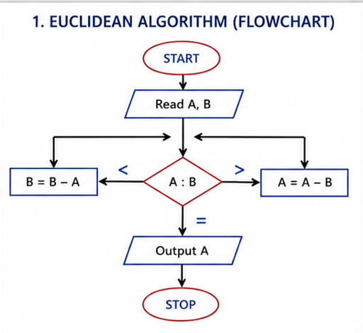
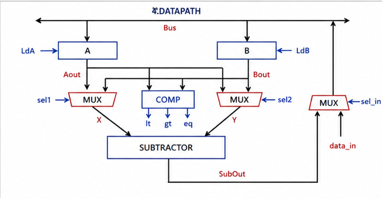
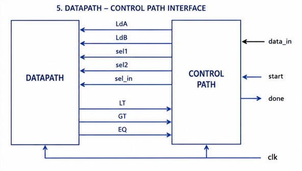

# Introduction

The **Greatest Common Divisor (GCD)** is the largest positive integer that divides two numbers without leaving a remainder. It is a fundamental arithmetic operation widely used in digital systems, cryptography, embedded applications, and computational algorithms.

This project presents the RTL implementation of a **GCD Processor** using the **Euclidean Algorithm** in **Verilog HDL**. The design follows a modular **Controller–Datapath architecture**, where the datapath performs arithmetic and comparison operations, while the controller manages the execution using a **Finite State Machine (FSM)**. The complete design is functionally verified through simulation in **Xilinx Vivado**.

# Project Overview

This project implements a **Greatest Common Divisor (GCD) Processor** in **Verilog HDL** based on the subtraction-based **Euclidean Algorithm**. The processor computes the GCD of two 16-bit input operands by repeatedly comparing and subtracting the smaller value from the larger one until both operands become equal.

The design follows a modular **Controller–Datapath architecture**. The **Datapath** consists of registers, multiplexers, a comparator, and a subtractor to perform the required arithmetic and comparison operations, while the **Controller** is implemented as a **Finite State Machine (FSM)** that generates the control signals required to coordinate the computation.

The functionality of the complete design is verified using a self-checking **Verilog testbench** in **Xilinx Vivado**, demonstrating the correct computation of the GCD for multiple input combinations.

# Euclidean Algorithm

The GCD processor operates using the **subtraction-based Euclidean Algorithm**, which repeatedly compares two input operands and subtracts the smaller value from the larger one until both operands become equal. The common value obtained at the end of the computation represents the **Greatest Common Divisor (GCD)** of the two numbers.

The algorithm follows these steps:

1. Read the two input operands **A** and **B**.
2. Compare the values of **A** and **B**.
3. If **A > B**, update **A = A − B**.
4. If **B > A**, update **B = B − A**.
5. Repeat the comparison and subtraction process until **A = B**.
6. The final value of **A** (or **B**) is the **Greatest Common Divisor (GCD)**.

  

<b>Figure 1.</b> Flowchart of the Subtraction-Based Euclidean Algorithm

# System Architecture

The GCD processor is designed using a modular **Controller–Datapath architecture**, a widely adopted design methodology in digital systems. The architecture is divided into two major components: the **Datapath**, which performs arithmetic and comparison operations, and the **Controller**, which generates the control signals required to coordinate the execution of the Euclidean Algorithm.

The **Datapath** contains the hardware elements responsible for computation, including registers, multiplexers, a comparator, and a subtractor. It continuously compares the two input operands and performs the required subtraction operation based on the control signals received from the controller.

The **Controller** is implemented as a **Finite State Machine (FSM)** that sequences the execution of the algorithm. Based on the status signals generated by the datapath, it determines the next operation, controls data movement between registers, and asserts the **done** signal once the GCD computation is complete.

Together, the Controller and Datapath operate synchronously to compute the Greatest Common Divisor efficiently while maintaining a clear separation between control logic and arithmetic operations.

  

<b>Figure 2.</b> Top-Level Block Diagram of the GCD Processor

# Datapath Architecture

The **Datapath** is the computational unit of the GCD processor and is responsible for executing the arithmetic and comparison operations required by the Euclidean Algorithm. It receives control signals from the controller and performs the corresponding operations on the input operands.

The datapath consists of **input registers**, **multiplexers**, a **comparator**, and a **subtractor**. The input operands are first loaded into registers, after which the comparator continuously evaluates their relationship (**A > B**, **A < B**, or **A = B**). Based on the comparison result, the subtractor computes the difference between the operands, and the updated value is written back into the appropriate register through the multiplexers. This process is repeated until both operands become equal, at which point the resulting value represents the **Greatest Common Divisor (GCD)**.

  

<b>Figure 3.</b> Datapath Architecture of the GCD Processor

---

## Datapath–Controller Interface

The **Datapath** and **Controller** communicate through a set of control and status signals. The controller generates signals to load registers, select multiplexer inputs, and enable arithmetic operations, while the datapath provides status signals indicating the comparison results between the operands. This interaction enables the controller to sequence the Euclidean Algorithm and determine when the computation has been completed.

  

<b>Figure 4.</b> Datapath–Controller Interface of the GCD Processor

# Controller Design

The **Controller** is implemented as a **Finite State Machine (FSM)** that coordinates the execution of the Euclidean Algorithm by generating the necessary control signals for the datapath. Based on the comparator outputs (**LT**, **GT**, and **EQ**), the controller determines the sequence of operations, including loading registers, selecting arithmetic operations, updating operands, and indicating the completion of the computation.

By separating the control logic from the datapath, the design becomes modular, easier to understand, and more suitable for verification and future scalability.

---

## Finite State Machine (FSM)

  

<b>Figure 5.</b> Finite State Machine of the GCD Controller

---

## State Description

| State | Description |
|--------|-------------|
| **S0 (Idle)** | Waits for the `start` signal and initializes the processor. |
| **S1 (Load A)** | Loads the first input operand into Register A. |
| **S2 (Load B / Compare)** | Loads the second input operand into Register B and compares the two operands. |
| **S3 (B ← B − A)** | Updates Register B when **B > A** by performing the subtraction **B = B − A**. |
| **S4 (A ← A − B)** | Updates Register A when **A > B** by performing the subtraction **A = A − B**. |
| **S5 (Done)** | Asserts the `done` signal after both operands become equal, indicating that the GCD has been computed successfully. |

---

## Operational Flow

The controller begins by loading the two input operands into the datapath registers. It continuously monitors the comparator outputs (**LT**, **GT**, and **EQ**) to determine the relationship between the operands. Depending on the comparison result, the appropriate subtraction operation is enabled and the updated value is written back to the corresponding register. This iterative process continues until both operands become equal, after which the controller asserts the **`done`** signal to indicate successful completion of the GCD computation.

  

<b>Figure 6.</b> Operational Flow of the GCD Controller

# Functional Verification

The functionality of the GCD processor was verified using a **self-checking Verilog testbench** in **Xilinx Vivado Simulator**. Various pairs of input operands were applied to validate the correct execution of the subtraction-based Euclidean Algorithm. During simulation, the controller coordinates the datapath operations while continuously monitoring the comparator outputs until both operands become equal.

The simulation waveform confirms the correct loading of the input operands, iterative subtraction process, comparator status signals, and assertion of the **`done`** signal upon completion of the computation. Once the **`done`** signal becomes HIGH, the output register contains the correct **Greatest Common Divisor (GCD)** of the two input numbers.

## Simulation Waveform

  

<b>Figure 7.</b> Functional Simulation of the GCD Processor

The waveform illustrates the complete execution of the GCD processor. Initially, the two input operands are loaded into the datapath registers after the **`start`** signal is asserted. The controller then performs a sequence of comparison and subtraction operations according to the Euclidean Algorithm. When both operands become equal, the **`done`** signal is asserted, indicating that the computation has been completed successfully and the resulting value represents the Greatest Common Divisor.

---

## Console Output

The simulation results are further verified through a self-checking testbench, which automatically compares the computed GCD with the expected result for each test case. Successful verification is reported through **PASS** messages in the simulation console, confirming the functional correctness of the implemented design.

  

<b>Figure 8.</b> Console Output Showing Successful Functional Verification

# Tools Used

The following tools and software were used for the design, simulation, verification, and documentation of this project:

| Tool / Technology | Purpose |
|-------------------|---------|
| **Verilog HDL** | RTL design and hardware description |
| **Xilinx Vivado** | Design entry, simulation, and project development |
| **Vivado Simulator (XSIM)** | Functional simulation and waveform analysis |
| **Git & GitHub** | Version control and project documentation |
| **draw.io (diagrams.net)** | Block diagrams, flowcharts, and FSM illustrations |

# Conclusion

This project successfully implements a **Greatest Common Divisor (GCD) Processor** using the subtraction-based **Euclidean Algorithm** in **Verilog HDL**. The design adopts a modular **Controller–Datapath architecture**, where the datapath performs arithmetic and comparison operations while the FSM-based controller coordinates the overall execution.

Functional verification using **Xilinx Vivado Simulator** confirms the correct computation of the GCD for multiple input combinations. The project demonstrates fundamental concepts of RTL design, finite state machines, datapath-controller partitioning, and digital system verification, providing a strong foundation for designing more complex digital processors and hardware accelerators.
